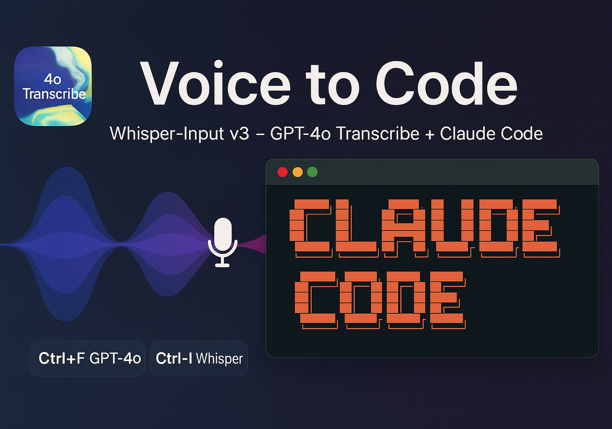

# Whisper-Input-Next - Enhanced Voice Transcription Tool

<p align="center">
  
</p>

<p align="center">
  <a href="../VERSION">
    
  </a>
  <a href="https://www.python.org/">
    
  </a>
  <a href="../LICENSE">
    
  </a>
  <a href="../README.md">
    
  </a>
</p>

一个基于语音转录的智能输入工具，支持多种转录服务和高质量的语音识别功能。

> 🐧 **Linux 用户**：Linux 桌面端支持在 [`linux` 分支](https://github.com/Mor-Li/Whisper-Input-Next/tree/linux) 上,由 [@MiaoDX](https://github.com/MiaoDX) 贡献并维护,感谢！我自己用 macOS,不亲自测试/维护该分支,所以它可能会落后于 `main`,请到该分支跟踪或贡献。

## 🚀 项目背景

本项目基于 [ErlichLiu/Whisper-Input](https://github.com/ErlichLiu/Whisper-Input) 进行二次开发。原项目已停止维护数月，我们在其基础上进行了大量功能扩展和架构优化，添加了OpenAI GPT-4o transcribe集成、音频存档、本地whisper支持等重要功能。[为什么要用这个项目？](./docs/[V3.0.0]_知乎blog.md)

## ✨ 主要特性

### 🎯 核心功能
- **多平台转录服务**: 支持OpenAI GPT-4o transcribe、GROQ、SiliconFlow、本地whisper.cpp
- **智能快捷键**: Ctrl+F (OpenAI高质量) / Ctrl+I (本地省钱模式)
- **音频存档**: 自动保存所有录音，支持历史回放
- **失败重试**: 智能错误处理和重试机制
- **实时状态**: 直观的录音和处理状态显示

### 🔧 技术特性
- **双处理器架构**: 同时支持云端和本地转录
- **180秒超时**: OpenAI专用长时间超时支持
- **自动标点**: GPT-4o transcribe自带标点符号
- **隐私保护**: 本地处理选项，数据不上传

## 📦 快速开始

### 环境要求
- Python 3.12+
- macOS/Linux (Windows支持开发中)
- 网络连接 (仅云端服务需要)
- **本地whisper.cpp** (使用本地转录功能时需要)

### 安装步骤

1. **克隆项目**
```bash
git clone https://github.com/Mor-Li/Whisper-Input-Next.git
cd Whisper-Input-Next
```

2. **创建虚拟环境**
```bash
python -m venv venv
source venv/bin/activate  # macOS/Linux
# 或 venv\\Scripts\\activate  # Windows
```

3. **安装依赖**
```bash
pip install -r requirements.txt
```

4. **安装本地whisper.cpp (可选，使用本地转录时需要)**
```bash
# 克隆whisper.cpp仓库
git clone https://github.com/ggerganov/whisper.cpp.git
cd whisper.cpp

# 编译 (macOS/Linux)
make

# 下载模型文件 (推荐large-v3)
bash ./models/download-ggml-model.sh large-v3

# 记录whisper-cli路径，稍后配置到.env文件
echo "Whisper CLI 路径: $(pwd)/build/bin/whisper-cli"
cd ..
```

5. **配置环境变量**
```bash
cp env.example .env
# 编辑 .env 文件，配置必要参数:
# - OFFICIAL_OPENAI_API_KEY: OpenAI API密钥 (必需)
# - WHISPER_CLI_PATH: whisper.cpp可执行文件路径 (使用本地转录时必需)
# - WHISPER_MODEL_PATH: whisper模型文件路径 (使用本地转录时必需)
```

6. **运行程序**
```bash
python main.py
# 或使用启动脚本
chmod +x start.sh
./start.sh
```

### ⚠️ 重要说明

**必需配置项：**
- `OFFICIAL_OPENAI_API_KEY`: OpenAI GPT-4o transcribe API密钥
- `WHISPER_CLI_PATH`: 本地whisper.cpp可执行文件绝对路径
- `WHISPER_MODEL_PATH`: whisper模型文件路径 (相对于whisper.cpp根目录)

**whisper.cpp安装指南：**
1. 从 [whisper.cpp仓库](https://github.com/ggerganov/whisper.cpp) 克隆并编译
2. 下载large-v3模型: `bash ./models/download-ggml-model.sh large-v3`
3. 在.env中配置正确的路径

## ⚙️ 配置说明

### 环境变量配置

在 `.env` 文件中配置以下参数：

```bash
# 服务平台选择 (推荐使用我们维护的双平台配置)
SERVICE_PLATFORM=openai&local  # 我们主要维护的配置

# OpenAI 配置 (必需)
OFFICIAL_OPENAI_API_KEY=sk-proj-xxx

# 本地whisper.cpp配置 (使用本地转录时必需)
WHISPER_CLI_PATH=/path/to/whisper.cpp/build/bin/whisper-cli
WHISPER_MODEL_PATH=models/ggml-large-v3.bin

# 键盘快捷键配置
TRANSCRIPTIONS_BUTTON=f
TRANSLATIONS_BUTTON=ctrl
SYSTEM_PLATFORM=mac  # mac/win

# 功能开关
CONVERT_TO_SIMPLIFIED=false
ADD_SYMBOL=false
OPTIMIZE_RESULT=false
```

**重要说明**: 
- 本项目主要维护 `SERVICE_PLATFORM=openai&local` 配置
- 这是我们推荐和测试最充分的配置
- 其他单平台配置（groq、siliconflow等）仅作兼容性保留

### 便捷启动别名设置 (推荐)

在shell配置文件中添加以下别名 (`~/.bashrc`、`~/.zshrc` 等)：

```bash
alias whisper_input='cd /path/to/Whisper-Input-Next && ./start.sh'
alias whisper_input_off='tmux kill-session -t whisper-input'
```

请将 `/path/to/Whisper-Input-Next` 替换为你的项目实际路径。

### 快捷键说明

| 快捷键 | 功能 | 服务 | 特点 |
|--------|------|------|------|
| `Ctrl+F` | 高质量转录 | OpenAI GPT-4o transcribe | 自带标点，质量最高 |
| `Ctrl+I` | 本地转录 | whisper.cpp | 离线处理，隐私保护 |

### 状态指示器

程序运行时会在光标位置显示简洁的状态指示器：

| 状态 | 含义 | 操作 |
|------|------|------|
| `0` | 正在录音 | 再次按快捷键停止录音 |
| `1` | 正在转录 | 请等待转录完成 |
| `!` | 转录失败/出错 | 再次按`Ctrl+F`重试（音频已保存） |

**设计优化**：
- 使用简洁数字状态，避免复杂emoji符号
- 不污染系统剪贴板，只在光标位置显示
- 状态清晰明了，便于快速识别

**重试机制说明**：
- 当转录失败时，系统会保存录音并显示`!`状态
- 此时无需重新录音，直接按`Ctrl+F`即可重试
- 重试会使用之前保存的音频，直到转录成功

## 📚 功能文档

- [🔊 音频存档功能](./docs/[V3.0.0]_AUDIO_ARCHIVE_FEATURE.md) - *v3.0.0引入*
- [🤖 Kimi润色集成](./docs/[DEPRECATED]_KIMI_USAGE.md) - *已废弃*
- [📊 状态显示优化](./docs/[V3.0.0]_STATUS_DISPLAY_IMPROVEMENTS.md) - *v3.0.0引入*
- [🔄 分支差异对比](./docs/[V3.0.0]_BRANCH_DIFFERENCES.md) - *v3.0.0引入*
- [📋 版本控制文档](./docs/[V3.0.0]_VERSION_CONTROL.md) - *v3.0.0建立*

## 🛠️ 开发状态

### ✅ 已完成功能
- [x] OpenAI GPT-4o transcribe集成 (180秒超时)
- [x] 双处理器架构 (云端+本地)
- [x] 音频存档系统 + 转录缓存(cache.json)
- [x] 智能重试机制 (多次失败循环重试)
- [x] 状态显示优化 (0→1→!)
- [x] 本地whisper.cpp支持
- [x] 项目文档完善

### 🚧 正在开发  
*当前无正在开发的功能*

### 📋 计划功能
*当前无计划功能*

### 🧪 实验性功能历史

#### iOS键盘扩展实验 (2025年8月14日)
**状态**: ❌ 因Apple限制而中止  
尝试创建iOS键盘扩展但发现连搜狗输入法都无法在键盘扩展中直接录音，受Apple系统限制。iOS语音输入目前无法作为无缝键盘扩展实现。

## 🤝 贡献指南

欢迎提交Issues和Pull Requests！

### 开发环境设置
```bash
# 克隆项目
git clone https://github.com/Mor-Li/Whisper-Input-Next.git
cd Whisper-Input-Next

# 设置开发模式
pip install -r requirements.txt
pip install -e .

# 运行测试
python -m pytest test/
```

### 提交规范
- feat: 新功能
- fix: 修复问题  
- docs: 文档更新
- style: 代码风格
- refactor: 重构
- test: 测试相关

## 📄 许可证

本项目采用 MIT 许可证。详见 [LICENSE](LICENSE) 文件。

## 🙏 致谢

- 感谢 [ErlichLiu](https://github.com/ErlichLiu) 提供的原始项目基础
- 感谢 OpenAI 提供的强大转录服务
- 感谢所有贡献者和用户的支持

## 📞 联系方式

- **项目地址**: https://github.com/Mor-Li/Whisper-Input-Next  
- **问题报告**: [Issues](https://github.com/Mor-Li/Whisper-Input-Next/issues)
- **功能建议**: [Discussions](https://github.com/Mor-Li/Whisper-Input-Next/discussions)

---

**⭐ 如果这个项目对你有帮助，请给个Star支持一下！**